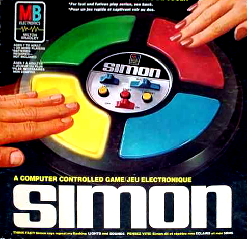

# Simon ® 
## The Classic Game of Memory Skill 
### *Think fast... SIMON says, "Chase my flashing lights and sounds"!*

## Rules
1. Press START button; SIMON will illuminate the first colored section in a sequence.

2. Begin by pressing the same section.

3. SIMON will duplicate the first move and add one.

4. Repeat these two signals by pressing the same sections.

5. SIMON will duplicate these signals and continue to add one.

6. Continue in this manner as long as you can repeat the sequence correctly.

7. If you fail to repeat a sequence exactly or if you take more than 5 seconds to repeat a signal, SIMON responds with a
"RAZZ" sound indicating that you have lost.

## Technology Used
* **HTML5**
* **CSS**
* **SVG**
* **Javascript**
* **Jquery**

## Installation Instructions

#### Play on your computer:
1. [**Download the .zip file**](https://github.com/AaronJGoldsmith/SimonJS/archive/master.zip)
2. Double-click "SimonJS-master.zip" to extract files 
3. Open index.html

#### Play on the web: **<https://aaronjgoldsmith.github.io/SimonJS/>**

#### Clone the project repository from Github:
##### In bash, type:
1. 'git clone git@github.com:AaronJGoldsmith/SimonJS.git'
2. 'git cd SimonJS'
3. 'open index.html'

## Sounds for specific sections
* **E-note** (blue)
* **C#-note** (yellow)
* **A-note** (red)
* **E-note** (green)

## Trello
#### <https://trello.com/b/eFfWUqyA/simon-says-javascript>

## Approach Taken
* Identify each colored section with sound in a jQuery object
* Store and compare user's sequence and Simon's sequence of moves in arrays
* Time the 'turning on' and 'turning off' of the sections with .setTimeout() method and jQuery mouse listeners.
* Utilize the CSS property 'filter' to adjust the brightness of the colored sections at different time intervals to simulate lighting up and turning off.
* Adjust the timing of the color flashing for 'easy' and 'hard' difficulty

## Unresloved Issues
* Colored sections are not accurately responsive with corresponding sounds for the length of time they are pressed.
* SVG win/lose messages are not precisely centered.

